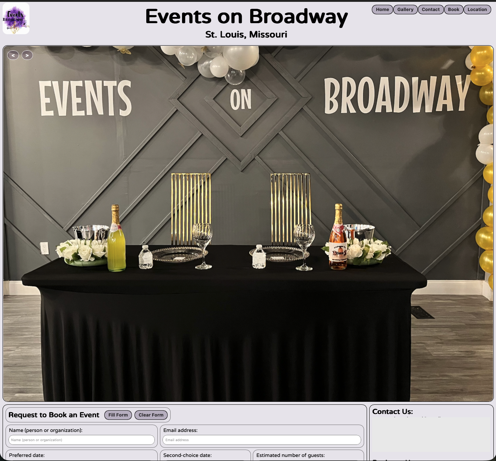
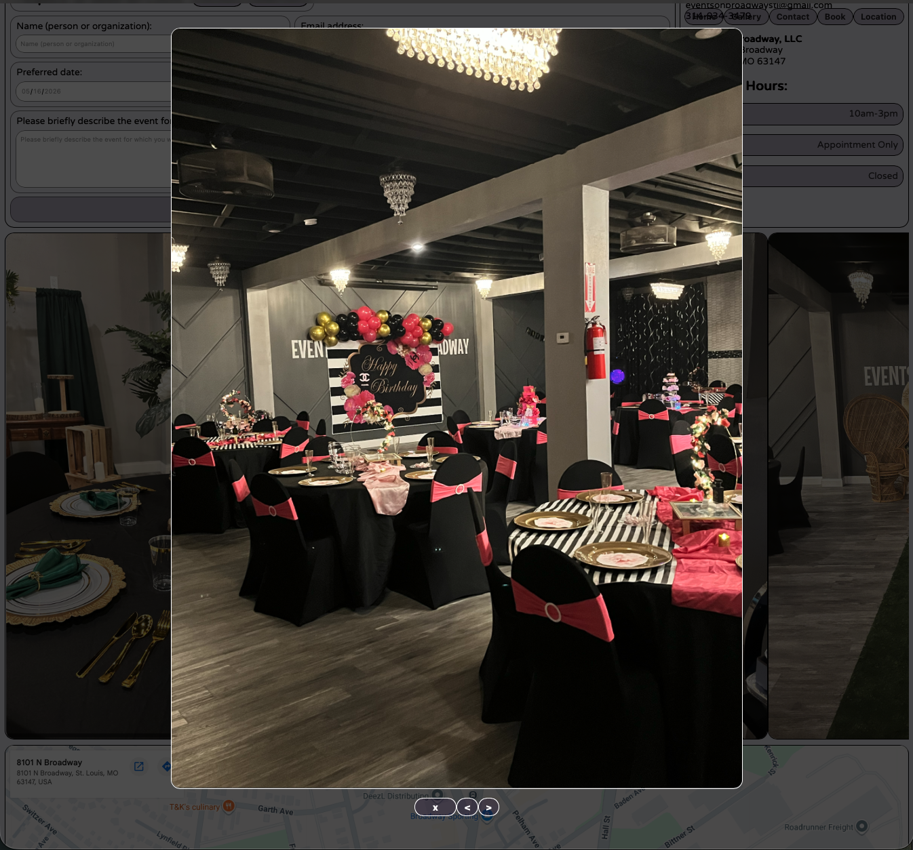
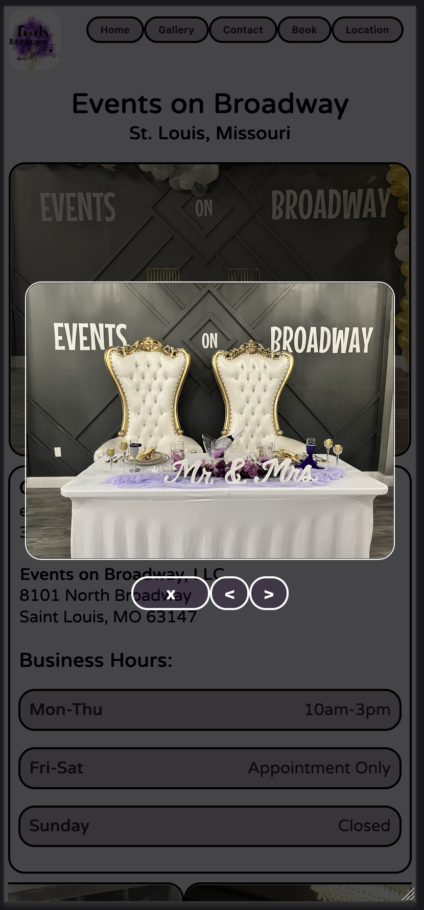
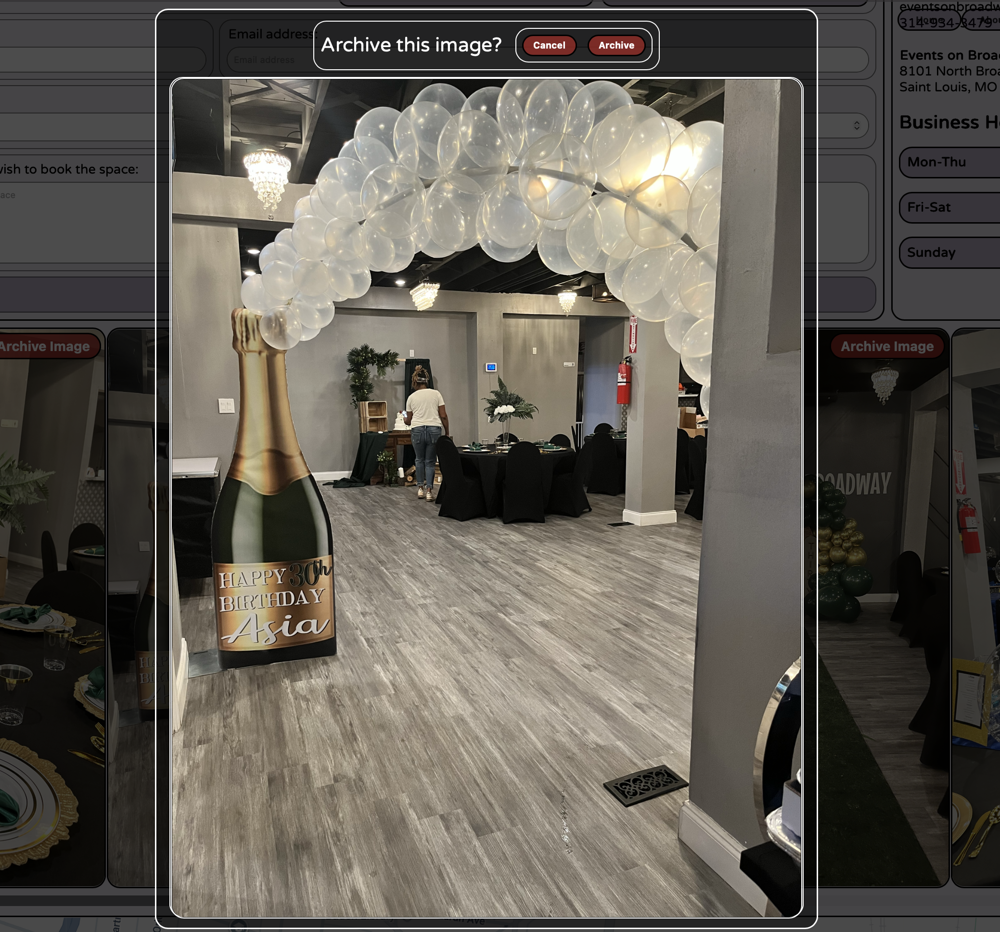
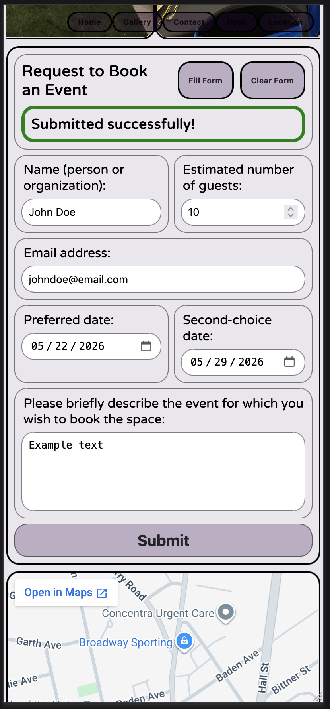
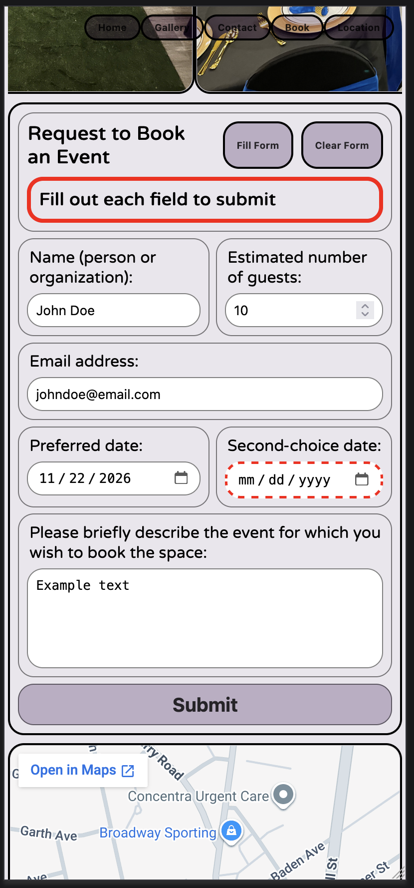

# Events on Broadway (STL) Website Source Code
- Commissioned by Events on Broadway St. Louis
- Developed/maintained by Justin DeKock April 2026-current
- [Public Site](https://eventsonbroadwaystl.com)

## Site architecture
- ### Data
    Important visible data used in the application is defined in `./data/eventsOnBroadwayData.json`
- ### React Frontend
    The site is a React (TypeScript) application bundled and tested with Vite/Vitest. React components are written in `./src/cmp` and nested directories. The React entrypoint (`main.tsx`) and other global files exist in `./src`. 
- ### Express Backend
    Express JS is utilized as the backend REST API for supporting form submission functionality, photo uploads for site owners, etc. Backend-specific code exists in `./src/api`
- ### Hosting
    The site is in early development as of 05/06/2026; a Docker container will be configured to serve the built site via NGINX when development is complete. The company will pay a small monthly fee to a virtual private server provider to run the container. 

## Main page screenshot

## Photo gallery screenshot (desktop)

### Horizontal gallery (phone)

## Admin page (behind http basic auth)
#### Confirm Archive Image popup

## Booking request form
#### (showing success message)

#### (showing error message)

