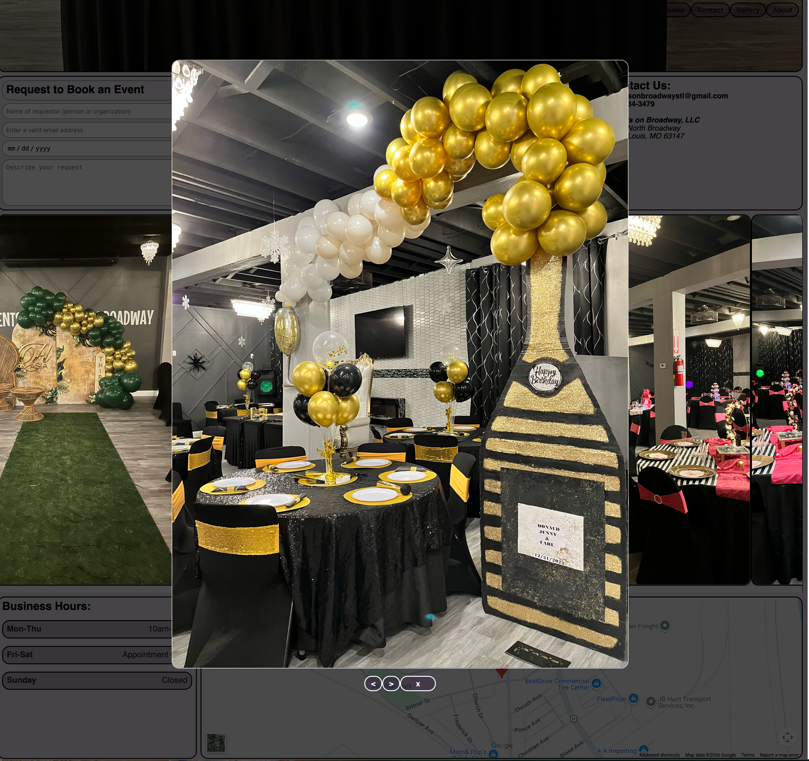

# Events on Broadway (STL) Website Source Code
- Commissioned by Events on Broadway St. Louis
- Designed/developed by Justin DeKock April 2026-current

## Site architecture
- ### React
    The site is a React (TypeScript) application bundled and tested with Vite/Vitest. React components are written in `./src/cmp` and nested directories. The React entrypoint (`main.tsx`) and other global files exist in `./src`. 
- ### Data
    Important visible data used in the application is defined in `./data/eventsOnBroadwayData.json`
- ### Hosting
    The site is in early development as of 05/06/2026; a Docker container will be configured to serve the built site via NGINX when development is complete. The company will pay a small monthly fee to a virtual private server provider to run the container. 

## Main page screenshot

## Photo gallery screenshot

